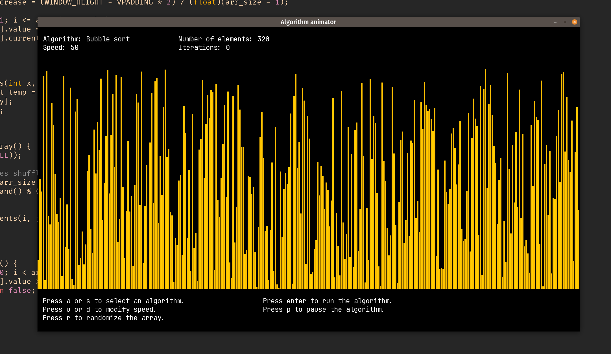
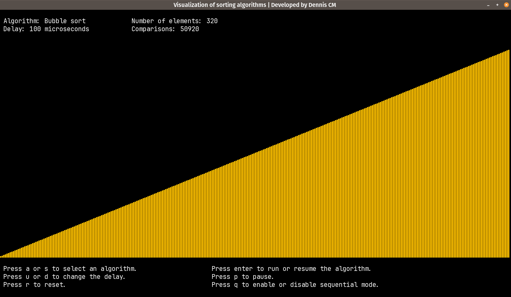
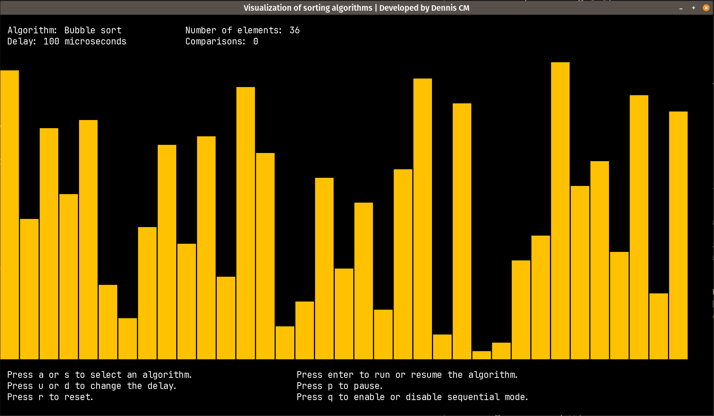

# algo-animator

An interactive program to visualize sorting algorithms.

This project is inspired by - off course - the video by Timo Bingmann called 
[15 sorting algorithms in 6 minutes](https://www.youtube.com/watch?v=kPRA0W1kECg).





## Compile

```bash
mkdir build
cd build
cmake ..
make
```

*Currently I've only tested this project on Linux. However, I would like to prepare it so 
that it can be used on Mac and Windows. However, my cross-platform experience is almost 
non-existent. Maybe in the future I'll check how to do it*

## Run

To customize the program you can pass the following arguments. 

```bash
./algo_animator WINDOW_WIDTH WINDOW_HEIGHT RECTANGLE_WIDTH SPACE_BETWEEN_RECTANGLES
```

The default values are:

```bash
WINDOW_WIDTH = 1920
WINDOW_HEIGHT = 1080
RECTANGLE_WIDTH = 5
SPACE_BETWEEN_RECTANGLES = 1
```

Run the program in a window with width of 1920 pixels and height of 1080 pixels, 
fit the screen with rectangles with width of 50 pixels, and add a space between
rectangles of 3 pixels.

```bash
./algo_animator 1920 1080 50 3
```




## Examples

### Normal mode

Just run the program and press `ENTER`
[Screencast from 06-29-2023 07:36:54 PM.webm](https://github.com/denniscmartin/algo-animator/assets/66180929/10e359c2-364c-4de4-9d7c-94caa582638c)

### Slow motion

Use `u` to increase the delay, then `ENTER` to run the algorithm   
*The delay is applied after each iteration*

### Pause mode

Press `ENTER` then `p`

### Sequential mode

Press `q` then press `ENTER` to visualize the algorithm step by step.
