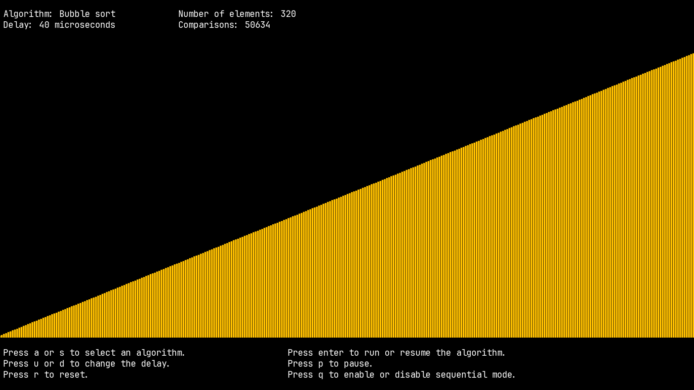
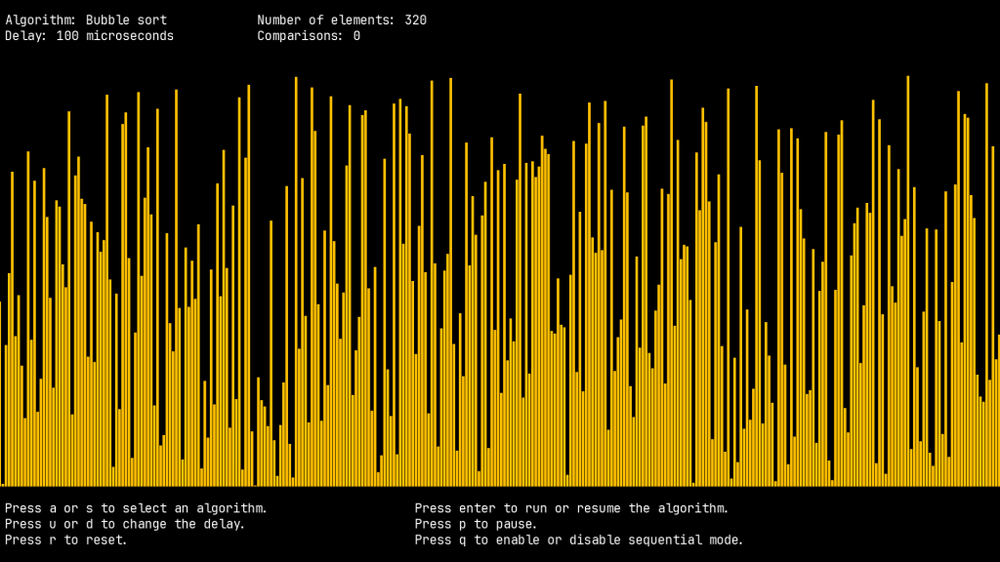

# Algo Animator

This project is inspired by the video of Timo Bingmann called [15 sorting
algorithms in 6 minutes](https://www.youtube.com/watch?v=kPRA0W1kECg)

 

## Usage

### Compile

	mkdir build cd build cmake ..  make

Currently I've only tested this project on Linux. However, I would like to
prepare it so that it can be used on Mac and Windows. However, my
cross-platform experience is almost non-existent. Maybe in the future I'll
check how to do it.

### Run

To customize the program you can pass the following arguments.

	./algo_animator WINDOW_WIDTH WINDOW_HEIGHT RECTANGLE_WIDTH
	SPACE_BETWEEN_RECTANGLES

The default values are:

	WINDOW_WIDTH = 1920 WINDOW_HEIGHT = 1080 RECTANGLE_WIDTH = 5
	SPACE_BETWEEN_RECTANGLES = 1

Run the program in a window with width of 1920 pixels and height of 1080
pixels, fit the screen with rectangles with width of 50 pixels, and add a space
between rectangles of 3 pixels.

	./algo_animator 1920 1080 50 3

# Notes

This project has not been designed to compare the speed of the algorithms side
by side. The main objective is the visualization of the algorithms for
educational purposes.

